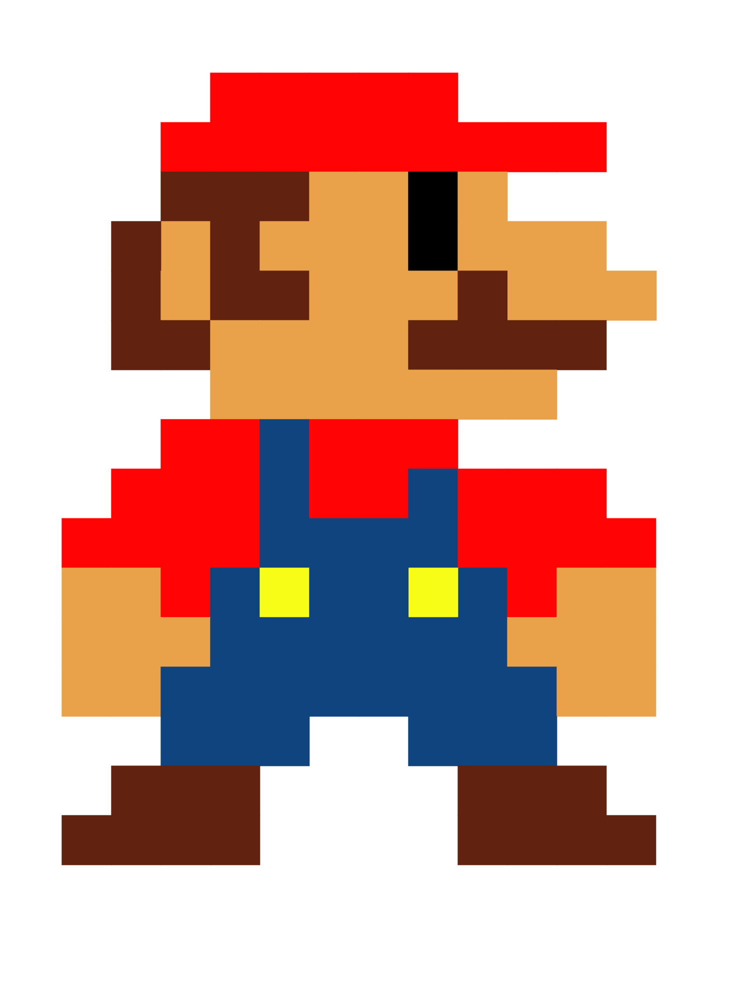

> #### Version 1.0.0Beta
> - Project not yet completed
> - Only the Nintendo DS and WII consoles are supported
> - 

 
 
<h1 align="center"> Nintendo Master Key Generator</h1>
 
 
 

    

 

    <a href="./CONTRIBUTING.md">Contributing</a>
    ·
    <a href="https://github.com/ZhengLinLei/nintendo-reset/issues">Issues</a>

    &nbsp;
    

 
 

## Introduction

This is a simple tool to generate the master key for the Nintendo DS consoles including the WII and the 3DS.

Try it out online [here](https://zhenglinlei.github.io/nintendo-reset/).

## Languages Avaliable

- [] [Python](./python)
- [] [JavaScript (Node.js)](./javascript/)

## Contributing

To contribute the project, please read the [CONTRIBUTING.md](CONTRIBUTING.md) file.

## License

MIT License